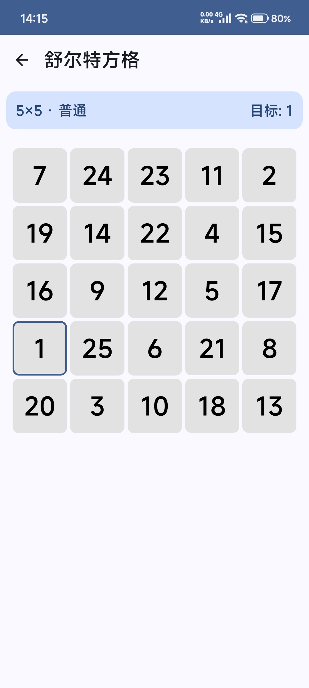
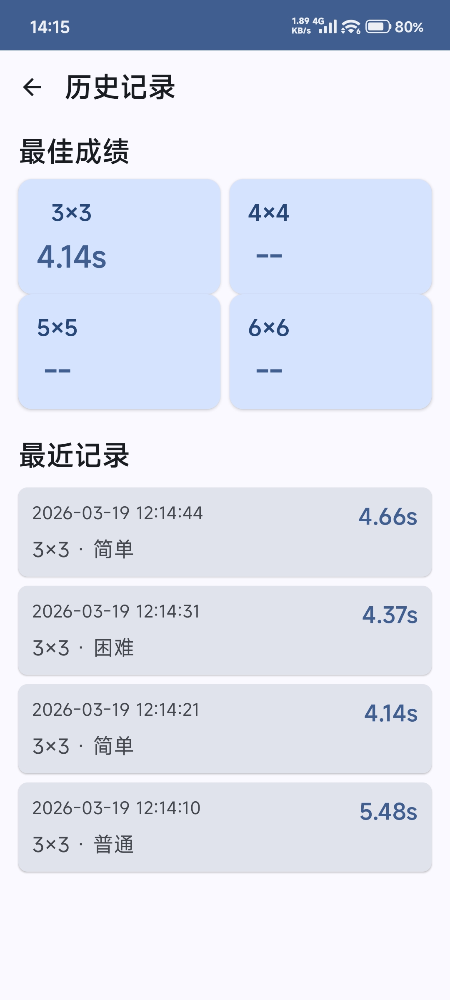

# 舒尔特方格 (schulte-grid)

  

一个注意力训练游戏

## 游戏简介

舒尔特方格是一种注意力训练游戏，由25个方格组成的方阵构成，训练时将数字1-25随机填入，被测者需按顺序指读并计时完成 。训练过程中，被测者需用手指依次指出数字位置并诵读，测试者通过生成不同排列的表格进行计时记录 。

该训练方法可通过自制数字卡片实施，完成时间越短表明注意力水平越高。飞行员平均成绩为6.25秒 。辽宁地质工程职业学院心理健康教育中心的虚拟现实训练系统包含舒尔特方格训练套件，具备级别、时间、帮助等功能 。

> 参考资料：[百度百科 - 舒尔特方格](https://baike.baidu.com/item/%E8%88%92%E5%B0%94%E7%89%B9%E6%96%B9%E6%A0%BC/5372437)

## 软件截图

  
  
  

## 功能特性

- **多种网格大小**: 3×3, 4×4, 5×5, 6×6
- **三种难度级别**:
  - 简单: 点击后有视觉反馈 + 目标数字边框高亮
  - 普通: 点击后有视觉反馈
  - 困难: 点击后有视觉反馈 + 按错罚时100ms + 点击第一个数字后所有数字隐藏
- **历史记录**: 查看最近100条游戏记录
- **最佳成绩**: 按网格大小统计最佳成绩

## 下载链接

github下载：https://github.com/tuokun/schulte-grid/releases/tag/v2.1.0

夸克网盘：https://pan.quark.cn/s/653b3744aa33

蓝奏云：https://cgfhsc.lanzoue.com/i5Aiu3kzoafi

## 项目迭代目标

- [ ] 成绩统计（日，月，年）
- [ ] 多彩方块
- [ ] 全局深色模式
- [ ] 性能优化

## License

本项目基于 [deepkolos/SchulteGrid](https://github.com/deepkolos/SchulteGrid) fork 并使用 Kotlin 重构。

GPL-3.0 © deepkolos (2018) & cgfhsc (2026)
